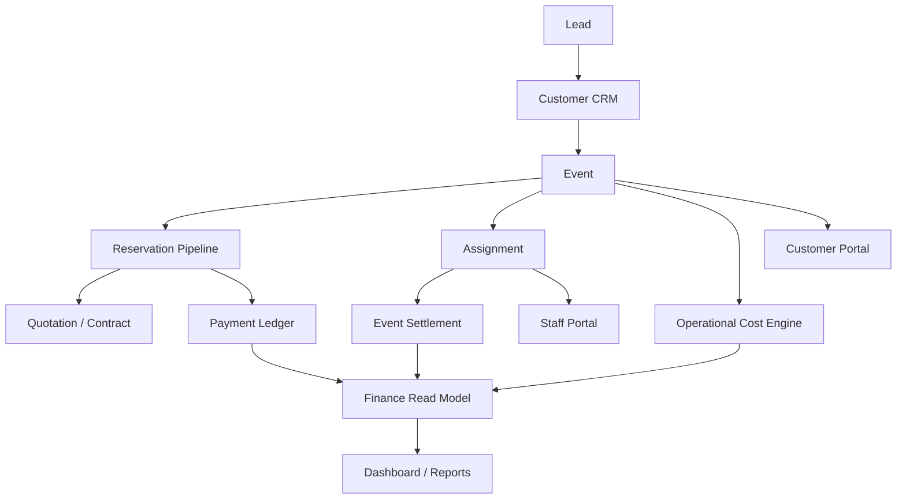

# Data Flow

```mermaid
flowchart TD
  L[Lead] --> C[Customer CRM]
  C --> E[Event]
  E --> R[Reservation Pipeline]
  R --> Q[Quotation / Contract]
  R --> P[Payment Ledger]
  E --> AS[Assignment]
  AS --> ES[Event Settlement]
  E --> OC[Operational Cost Engine]
  P --> F[Finance Read Model]
  ES --> F
  OC --> F
  F --> D[Dashboard / Reports]
  E --> PC[Customer Portal]
  AS --> PS[Staff Portal]
```

Los cambios se originan en el módulo propietario y actualizan proyecciones automáticamente. Las comunicaciones a clientes requieren acción explícita del Founder.
