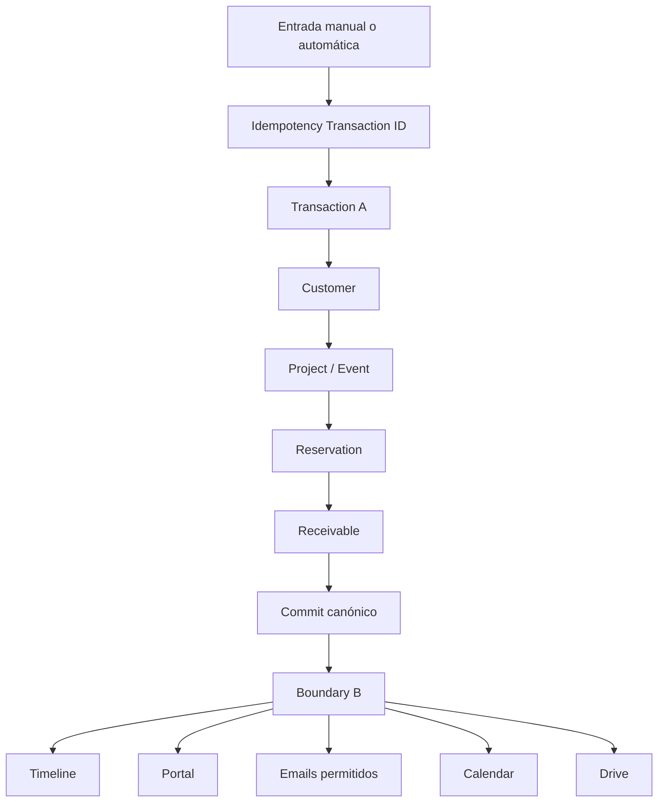

# Reservation Architecture

Existe un solo pipeline para reservas manuales, automáticas, corporativas y matrimonios.

Los reintentos reutilizan registros existentes. Una falla Boundary B se registra y alerta, pero no convierte una reserva confirmada en error. La confirmación manual no comunica al cliente automáticamente; la comunicación es una acción distinta.
