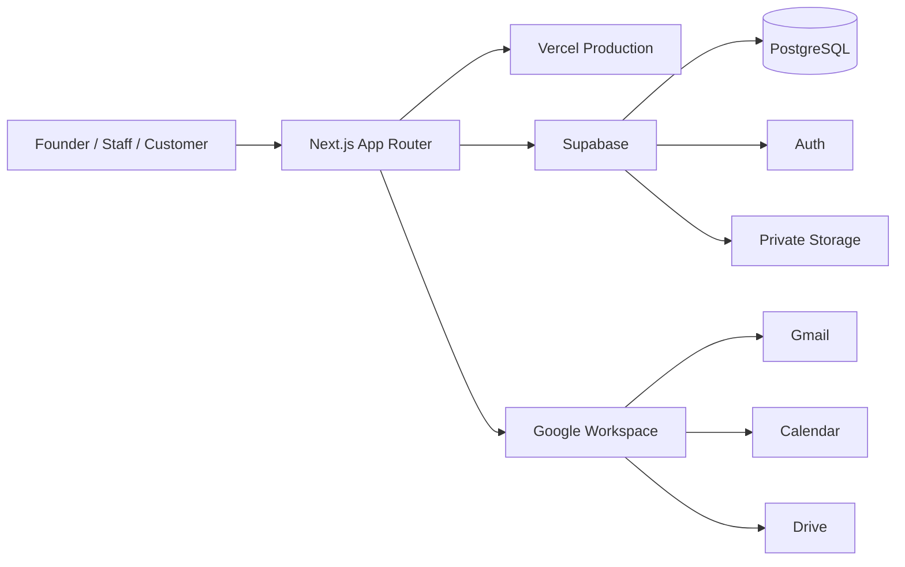

# System Architecture

Next.js contiene Server Components, Server Actions y APIs. Vercel ejecuta Production y Cron. Supabase conserva la verdad transaccional, autorización RLS, RPCs, auditoría y archivos privados. Las integraciones Google son efectos posteriores a los commits canónicos cuando corresponde.

La Constitución en `docs/orbit-constitution.md` rige toda evolución: una fuente por objeto, un Pipeline de Reserva, Customer permanente, Event operacional, Finance y Dashboard como lectura.
