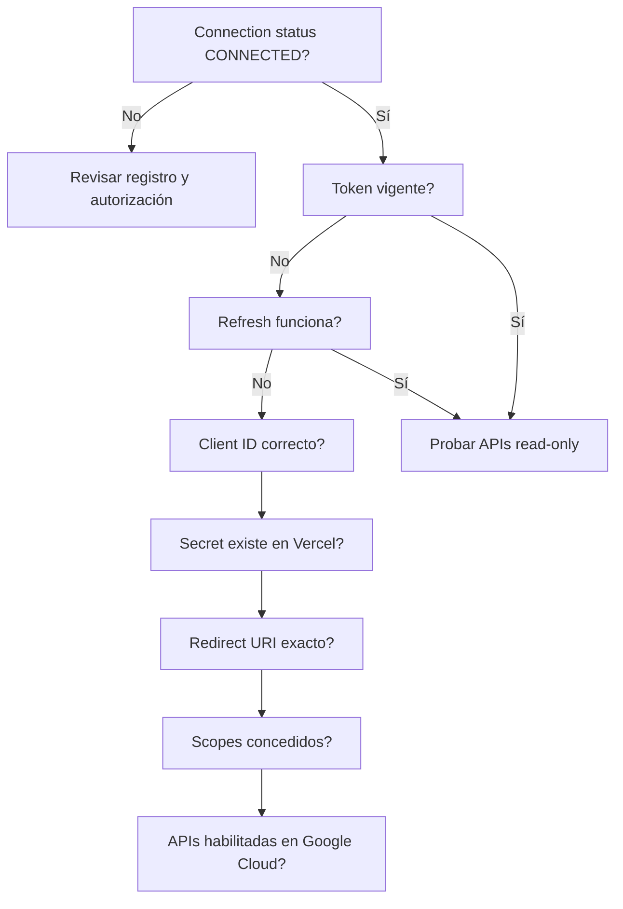

# Google OAuth Recovery

Registrar status HTTP y timestamps sin tokens. `401` después de refresh indica credencial/consentimiento; `403` suele indicar scope, API o policy. Solo reconectar después de agotar verificaciones read-only. No rotar ni eliminar los dos secretos OAuth existentes sin una decisión separada y plan de rollback.
